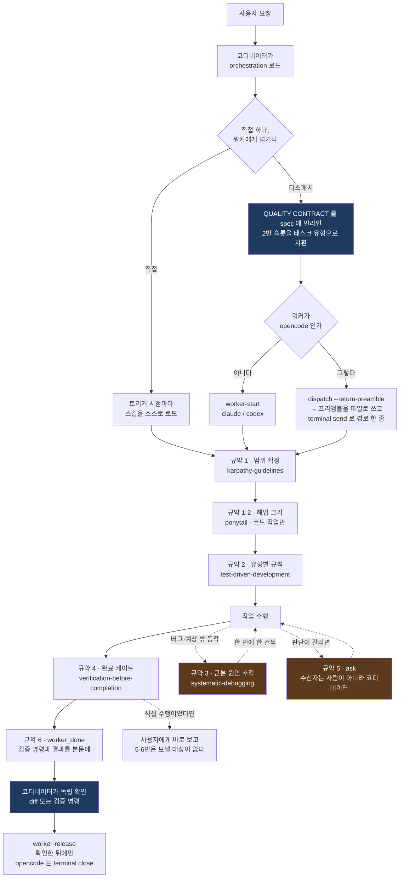
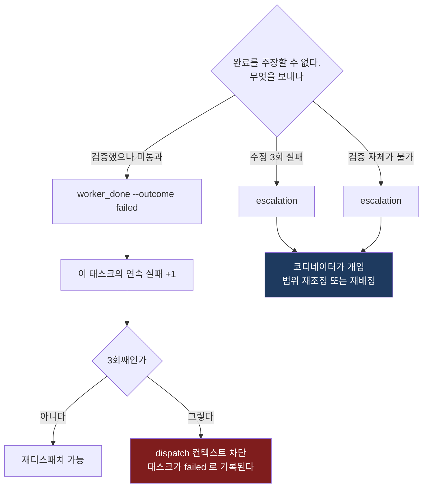

# Orca 사내 배포판 스킬 번들

회사에 설치된 Orca에 그대로 넣어 쓰는 스킬 모음이다. `orchestration`으로 작업을 지시하면
엔지니어링 규율 스킬들이 별도 지시 없이 적절한 시점에 걸리도록 `orchestration`을
커스터마이징해 두었다.

**Orca 소스는 수정하지 않는다.** 이 저장소의 `skills/` 아래 폴더들을 복사만 하면 동작한다.

설치 후 실제로 어떤 동작이 일어나는지는 **[동작 설명서](docs/how-it-works.md)** 에
흐름도와 함께 정리해 두었다. 워커가 밟는 게이트 순서, 스킬이 워커에 닿는 두 경로,
교착이 생기는 지점, 실패 모드별 확인 방법을 다룬다.

번들에 더할 스킬을 검토한 결과는 **[추가 도입 후보](docs/skill-candidates.md)** 에 있다.
Orca orchestration과 충돌하는 스킬이 있어 판정 근거를 함께 적어 두었다.

## 구성

```
skills/
  orchestration/                  stablyai/orca 원문 + 품질 스킬 라우팅 (커스터마이징)
  orca-cli/                       stablyai/orca 원문
  karpathy-guidelines/            범위 통제, 가정 명시, 검증 가능한 성공 기준
  ponytail/                       해법의 크기를 정하는 사다리 (YAGNI → 재사용 → 최소 구현)
  test-driven-development/        구현 전 실패 테스트
  systematic-debugging/           수정 제안 전 근본 원인 추적
  verification-before-completion/ 완료 주장 전 증거
```

## 어디에 넣나

`skills/` **아래의 7개 폴더**를 아래 경로에 통째로 복사한다. `skills/` 폴더 자체가 아니라
그 안의 내용물이다.

| 경로 (Windows) | 경로 (macOS/Linux/WSL) | 넣는 이유 |
|---|---|---|
| `%USERPROFILE%\.agents\skills\` | `~/.agents/skills/` | Orca가 "Agent skills home"으로 인식하는 공용 경로. **필수** |
| `%USERPROFILE%\.claude\skills\` | `~/.claude/skills/` | Claude Code가 읽는 경로. Claude Code는 `.agents\skills`를 읽지 않으므로 따로 필요하다 |

**opencode 전용 경로(`~/.config/opencode/skills`)는 만들지 않는다.** opencode는 위 두 곳을
이미 스캔한다 — `~/.claude/skills`, `~/.agents/skills`, `~/.config/opencode/skills`를 모두
읽고, 프로젝트 쪽의 `.claude/skills`, `.agents/skills`, `.opencode/skills`도 함께 본다.
세 곳에 같은 스킬 이름을 두면 **어느 사본이 로드될지가 실행마다 갈린다.** opencode의 스킬
로더는 동시성 제한 없이 파일을 읽고 같은 이름은 나중에 끝난 쪽이 이기기 때문이다. 실제로
스킬을 세 경로에 모두 넣고 `opencode debug skill`을 5회 돌리면 `orchestration`이 잡히는
사본이 `.agents`와 `.config/opencode` 사이에서 왔다 갔다 한다(opencode 1.18.26에서 확인).

이전 판을 따라 `~/.config/opencode/skills`에 이미 복사했다면 **거기 있는 이 번들의
폴더를 지운다.** 지워도 opencode는 남은 두 경로에서 그대로 찾는다.

두 곳은 그래도 남으므로 **한쪽만 고치지 않는다.** 항상 아래 스크립트로 두 경로를 함께
갱신하고, 확인도 두 사본 모두에 대해 한다. 사본 자체를 없애고 싶으면
`.claude\skills\<이름>`을 `.agents\skills\<이름>`으로 향하는 심볼릭 링크(Windows는
junction)로 만든다. opencode도 Claude Code도 링크를 따라간다.

복사 후 이런 모양이 되어야 한다:

```
%USERPROFILE%\.agents\skills\
  orchestration\SKILL.md
  orca-cli\SKILL.md
  karpathy-guidelines\SKILL.md
  ponytail\SKILL.md
  systematic-debugging\SKILL.md
  test-driven-development\SKILL.md
  verification-before-completion\SKILL.md
```

같은 이름의 스킬이 이미 있으면 **폴더째 지우고 새로 복사한다.** 파일만 덮어쓰면 상류에서
제거된 참조 문서가 남아 스킬이 없는 파일을 가리키게 된다.

### PowerShell로 한 번에

```powershell
# 저장소를 받은 폴더에서 실행
$src = ".\skills"
foreach ($dst in @(
    "$env:USERPROFILE\.agents\skills",
    "$env:USERPROFILE\.claude\skills"
)) {
    New-Item -ItemType Directory -Path $dst -Force | Out-Null
    Get-ChildItem $src -Directory | ForEach-Object {
        $target = Join-Path $dst $_.Name
        if (Test-Path $target) { Remove-Item $target -Recurse -Force }
        Copy-Item $_.FullName $target -Recurse -Force
    }
    Write-Host "설치: $dst"
}
```

## 설치 확인

복사했다고 동작하는 것이 아니다. 아래 순서로 확인한다.

**먼저 에이전트를 재시작한다.** opencode도 Claude Code도 스킬을 시작할 때 한 번만 읽고
핫리로드하지 않는다. 이미 떠 있는 세션과 Orca가 띄워 둔 워커 터미널에는 복사 결과가
반영되지 않으므로, 확인 전에 모두 종료했다가 다시 연다. **복사한 뒤 아무것도 안 보인다면
십중팔구 이것이다.**

```bash
# 1. Orca가 스킬을 인식하는가
orca skills installed | grep -E 'karpathy|ponytail|test-driven|systematic-debug|verification-before'

# 2. 설치한 사본 전부에 라우팅이 실렸는가 (사본마다 1 이상이어야 한다)
grep -c 'QUALITY CONTRACT' ~/.agents/skills/orchestration/SKILL.md \
                           ~/.claude/skills/orchestration/SKILL.md

# 3. opencode가 스킬을 보는가 — 이름과 함께 어느 사본을 잡았는지도 나온다
opencode debug skill > /tmp/oc-skills.json
grep -n 'orchestration/SKILL.md' /tmp/oc-skills.json
```

3번이 아무것도 출력하지 않으면 opencode가 orchestration을 못 찾은 것이다. `debug skill`은
`<built-in>`인 `customize-opencode`까지 포함해 opencode가 실제로 로드한 전부를 JSON으로
찍으므로, 여기 없으면 워커에도 없다. 출력이 크니 파이프로 바로 넘기지 말고 파일로 받는다.

PowerShell이면 2·3번은 이렇게:

```powershell
Select-String -Pattern 'QUALITY CONTRACT' -Path @(
    "$env:USERPROFILE\.agents\skills\orchestration\SKILL.md",
    "$env:USERPROFILE\.claude\skills\orchestration\SKILL.md"
)
opencode debug skill > "$env:TEMP\oc-skills.json"
Select-String -Path "$env:TEMP\oc-skills.json" -Pattern 'orchestration[\\/]SKILL\.md'
```

**4. 코디네이터가 만든 spec에 플레이스홀더가 남지 않았는지 본다.** 규약 2번은 태스크
유형에 따라 채워야 하는 자리다. `<<`가 남은 채로 디스패치되면 워커는 그 줄을 규칙이 아닌
빈칸으로 읽는다. 태스크가 하나도 없으면 통과가 아니라 무의미한 확인이니, 실제로 태스크를
만든 뒤에 본다.

```bash
orca orchestration task-list --json | grep -c '<<'   # 0이어야 한다
```

**5. 실제 디스패치 1건으로 확인한다.** 워커의 `worker_done` 보고서(`--body`)에 실행한 검증
명령과 그 결과가 들어 있는지 본다. 없으면 규약이 spec에 실리지 않은 것이다.
1~4번이 통과해도 코디네이터가 spec에 블록을 붙이지 않으면 아무 효과가 없으므로,
이것이 진짜 검증이다.

## 작업 파일은 `.orca/artifacts/` 안에만

계획, 중간 분석, 리뷰 노트, 장문 리포트는 요청받은 산출물이 아니라 **일을 하려고 만든
부산물**이다. 규칙이 없으면 에이전트가 제 자리를 정한다. 그래서 남의 프로젝트에 저장소
루트의 `PLAN-auth.md`, 읽던 파일 옆의 `notes.md`, 그때그때 새로 만든 폴더가 남고, 정작
프로젝트 주인은 코드만 담겨야 할 diff에서 그것들을 골라내야 한다.

**이 규칙은 디스패치 여부와 무관하게 적용된다.** 코디네이터든, 디스패치된 워커든,
디스패치를 전혀 하지 않고 그냥 사용자의 프로젝트에서 작업하는 세션이든 같다.

| 상황 | 폴더 |
|---|---|
| `taskId`가 있는 디스패치 워커 | `.orca/artifacts/<task_id>/` |
| `taskId`가 없는 경우 — 직접 작업, 전면 위임 | `.orca/artifacts/<짧은-이름>/` |

저장소 루트, `docs/`, 읽고 있던 코드 옆, 그때 새로 만든 최상위 폴더 — 어느 쪽도 아니다.
task id를 우선하는 이유는 코디네이터와 `worker_done` 페이로드와 `dispatch-show`가 이미
공유하는 유일한 식별자라, 남은 파일이 어느 작업의 것인지 되짚을 수 있기 때문이다. 없으면
작업을 알아볼 짧은 이름이면 된다. 폴더 안에서는 이름을 자유롭게 쓴다.

- **산출물은 예외다.** 실제로 만들라고 한 소스·테스트·문서는 프로젝트가 두는 자리에 둔다.
  이 규칙은 일을 하려고 만든 발판만 대상으로 한다.
- **디스패치가 있으면 `--report-path`도 그 안을 가리킨다.** 코디네이터가 파일을 찾아
  헤매지 않고 장문 보고서를 여는 것이 그 플래그의 존재 이유다.
- **`.orca/`는 이미 Orca의 워크스페이스 네임스페이스다** — `.orca/drops`, `.orca/templates`,
  `.orca/browser-downloads`, `.orca/issue-command`. `.orca`를 ignore 하는 프로젝트라면
  이 파일들이 `git status`에서 항목 하나로 통째로 빠진다. 그 항목을 넣을지는 프로젝트
  주인이 정할 일이고, **이 규칙을 깔끔하게 만들려고 남의 ignore 파일을 고치지 않는다.**

**워커는 spec만 본다.** 이 README도 스킬 파일도 읽지 않으므로, 규칙은 코디네이터가 보내는
텍스트에 실려야 한다. QUALITY CONTRACT의 1-1번이 그 역할이다.

`orca skills get orchestration`이 서비스하는 가이드에는 이 규약이 없다. 사내 Orca 소스에는
같은 취지의 변경이 들어갔지만(`f1c3963d`) 아직 빌드·배포 전이라, 그때까지는 이 번들이
유일하게 실제로 걸리는 경로다. 배포되면 이 절은 지우고 가이드를 따른다.

## 동작 방식

품질 스킬은 **두 경로로** 워커에 도달한다. 하나가 실패해도 나머지가 동작한다.

**1. spec 인라인 (정본).** 코디네이터가 `task-create --spec`에 QUALITY CONTRACT 블록을
이어붙인다. 워커 종류와 무관하게 프롬프트로 들어가므로 opencode 워커에도 적용된다.

**2. 스킬 자동 로드 (보강).** 워커가 스킬 description을 보고 필요한 시점에 스스로 로드한다.
각 스킬에는 `Orca dispatch 컨텍스트` 절이 있어 이 경로로 로드되어도 워커 환경에 맞게
동작한다. **opencode에도 이 경로가 있다** — 시스템 프롬프트에 `<available_skills>` 목록이
실리고 `skill` 툴로 본문을 읽으며, `/orchestration`처럼 슬래시로도 부를 수 있다
(opencode 1.18.26에서 확인).

경로 1만으로도 최소 게이트가 서고, 경로 2가 붙으면 세부 규칙까지 적용된다.
**그래도 스킬 이름만 적고 규약 본문을 빼면 안 된다.** 경로 2는 워커 쪽 설치 상태에
의존한다 — 사본이 낡았거나, 설치 뒤 재시작을 안 했거나, `permission.skill`이 막고 있으면
조용히 빠진다. 경로 1은 그 무엇에도 의존하지 않는 유일한 경로다.

### opencode 워커는 프롬프트를 파일로 받는다

같은 태스크라도 **워커가 opencode면 코디네이터가 프롬프트를 다른 방법으로 전달한다.**
claude와 codex 워커는 `worker-start` 한 번으로 시작하지만, opencode 워커는 터미널을 먼저
띄우고, `dispatch --return-preamble`로 받은 프리앰블을 워커 워크트리의
`.orca/artifacts/<task_id>/dispatch-preamble.md`에 쓴 다음, **그 파일을 읽으라는 한 줄만**
`terminal send`로 보낸다. `orchestration` 스킬이 그렇게 하도록 지시하고 있으니, 로그에서
보이더라도 잘못된 것이 아니다.

이유는 두 가지다.

**하나, Orca가 프롬프트를 주입할 때 붙이는 정착 게이트가 claude와 codex 전용이다.**
opencode에는 그 대신 고정 시간 대기가 걸리고, 주입 뒤 워커가 실제로 일을 시작했는지
지켜보는 30초 관찰도 opencode의 상태를 읽지 못하면 실패한다. 그렇게 되면 프리앰블은
입력창에 제출되지 않은 채로 남고 dispatch는 실행 중으로 표시되어, 코디네이터가 오지 않을
완료 보고를 계속 기다린다. 그래서 `--inject`(따라서 `worker-start`)를 쓰지 않는다.

**둘, 긴 프리앰블을 터미널 텍스트로 보내면 뒷부분이 잘린다.** 자르는 것은 Orca가 아니다 —
1.4.195에 프로브를 붙여 재보면 `terminal send`는 200 KB까지 한 바이트도 잃지 않고, 유일한
상한인 16 MiB는 잘리는 대신 거부된다. 잘리는 곳은 opencode의 입력창이다. Orca가
bracketed paste로 감싸주는 경로도 claude·codex 전용이라, opencode는 프리앰블을 그냥
키 입력으로 받는다. 그러면 개행 하나하나가 키 이벤트가 되고, 어디서 입력창이 "붙여넣기
중"이라는 판단을 놓고 제출해 버리는지는 opencode 버전과 화면 크기, 그때의 머신 부하에
달려 있다. **안전한 길이라는 게 존재하지 않아서** 크기로 나누지 않고 opencode는 항상 파일로
보낸다. 파일은 통째로 읽히거나, 못 읽었다고 보고되거나 둘 중 하나다.

그래서 opencode 워커를 쓰면 **눈에 보이는 차이가 셋** 있다.

- **워커 터미널에 프리앰블 대신 한 줄이 뜬다.** 스펙 전문이 입력창에 나타나지 않는 것이
  정상이다. 내용은 `.orca/artifacts/<task_id>/dispatch-preamble.md`에 있다.
- **워커 터미널이 자동으로 닫히지 않는다.** `worker-start`를 거치지 않은 dispatch는 감독
  대상이 아니라서 `worker-release`가 아무것도 닫지 않는다. 코디네이터가 `terminal close`로
  정리하거나 확인용으로 열어 둔다.
- **태스크를 집어 들었는지 한 번 더 확인한다.** `terminal send`는 바이트를 썼다는 것만
  알려주고 파일을 썼다는 것도 누가 읽었다는 증거가 아니므로, 코디네이터가 `worker-read`로
  워커가 실제로 시작했는지 보고 나서 대기 루프에 들어간다.

`ask`와 `worker_done`은 그대로 동작하고, QUALITY CONTRACT도 프리앰블 파일에 그대로 실린다.
품질 게이트는 claude·codex 워커와 똑같이 걸린다.

### 라우팅

| 스킬 | 걸리는 시점 | 규약 번호 |
|---|---|---|
| `karpathy-guidelines` | 모든 코딩 작업, 범위를 정하는 순간부터 | 1 |
| `ponytail` | 범위가 정해지고 무엇을 만들지 고르는 순간, 코드를 쓰기 전 | 1-2 |
| `test-driven-development` | 구현 코드를 쓰거나 고치기 전 | 2 |
| `systematic-debugging` | 버그·테스트 실패·예상 밖 동작이 나타났을 때 | 3 |
| `verification-before-completion` | 완료 주장, `worker_done`, 커밋, PR 직전 | 4, 6 |

코디네이터 자신이 코드를 짤 때도 동일하게 적용된다. orchestration이 로드되어 있다는 것이
면제 사유가 아니다.

### 한 태스크에서 스킬이 걸리는 순서

아래는 이 브랜치가 배포하는 7종 기준이다. 규약 번호는 워커가 밟는 **시간 순서**이고,
3번과 5번은 단계가 아니라 조건이 맞을 때 발동하는 규칙이라 점선으로 그렸다.
오른쪽 아래 갈래는 디스패치일 때만 성립한다 — 코디네이터가 직접 하는 작업에는
`worker_done`도 `worker-release`도 없다.



### 스킬별 실행

#### `karpathy-guidelines` — 범위를 먼저 고정한다

본문은 네 절이다: 코딩 전에 생각하기, 단순한 것 먼저, 외과적 변경, 목표 기반 실행.
실행되면 스펙의 완료 조건을 **검증 가능한 체크리스트**로 바꾸고, 그 범위 밖의 파일은
건드리지 않는다. 판단이 필요한 지점은 가정을 명시하고 진행하되 보고서에 남긴다.

디스패치 상황에서 두 가지가 달라진다. 본문의 "확실하지 않으면 물어라"의 수신자가
사람이 아니라 코디네이터이고(`orca orchestration ask`), **공유 파일은 가정으로 처리하지
않는다.** 빌드 설정·의존성 매니페스트·공통 설정처럼 다른 태스크도 건드릴 파일은
가정하고 진행하는 대신 물어야 한다. 병렬 워커가 각자 "가정 명시 후 진행"으로 판단하면
같은 파일을 동시에 고쳐 서로의 작업을 덮는다. 이 규칙이 그것을 막는다.

#### `ponytail` — 사다리에서 처음 성립하는 칸에 멈춘다

`karpathy-guidelines`가 **무엇을 할지**의 범위를 정한다면 이 스킬은 **무엇을 만들지**의
크기를 정한다. 7단 사다리를 위에서부터 내려오며 처음 성립하는 칸에서 멈춘다: 존재해야
하는가(YAGNI) → 코드베이스에 이미 있는가 → 표준 라이브러리 → 플랫폼 기본 기능 → 이미
설치된 의존성 → 한 줄 → 최소 구현.

사다리는 **문제를 이해한 뒤에** 오른다. 본문이 "Never lazy about understanding the
problem"이라고 못 박는 이유가 이것이다 — 이해를 건너뛰고 나온 작은 diff는 효율이 아니라
자신 있게 틀린 수정이다. 입력 검증, 데이터 유실을 막는 에러 처리, 보안, 접근성은 어느
칸에서도 깎지 않는다.

번들의 다른 스킬과 겹치는 자리가 셋 있고, **규약 1-2번이 그 우선순위를 명시한다.**

| 겹치는 곳 | 어느 쪽이 이기나 |
|---|---|
| 상류 본문의 "사소한 코드엔 테스트 불필요" | **규약 2번(TDD)이 이긴다.** 사다리는 해법의 크기만 정한다 |
| 상류 본문의 "설명은 최대 3줄" | **규약 6번이 이긴다.** 검증 명령과 출력은 전부 `--body`에 싣는다 |
| 리뷰·조사 태스크 | 적용하지 않는다. 크기를 정할 해법이 없다 |

명시하지 않으면 워커는 같은 무게의 규칙 둘을 받는다. 어느 쪽을 따를지는 그때그때
갈리고, 그 결정이 spec이 아니라 워커의 읽는 순서에서 나온다. 우선순위 문장이 그것을
spec 쪽으로 되돌린다.

레벨(`lite`/`full`/`ultra`)은 디스패치에서 **full 고정**이다. `/ponytail` 슬래시 명령도
"stop ponytail"이라고 말해 줄 사람도 워커 터미널에는 없다.

**상류의 훅과 opencode 플러그인은 쓰지 않는다.** 그 경로는 매 턴 규칙 전문(~1,300 토큰)을
시스템 프롬프트에 주입하지만, 워커 호스트마다 설정이 필요해 디스패치마다 성립을 보장할 수
없다. 게다가 Claude Code용 `SessionStart` 훅은 statusline이 설정돼 있지 않으면 세션에
"statusline을 깔아 주겠다고 사용자에게 먼저 제안하라"는 지시를 주입한다 — 무인 워커에게는
태스크를 버리라는 말이다. 이 배포판이 규약 인라인만 쓰는 이유가 이것이다.

#### `test-driven-development` — 실패를 먼저 본다

Iron Law는 하나다. **실패하는 테스트를 실제로 본 뒤에야 구현 코드를 쓴다.** 테스트가
실패하는 것을 보지 않았다면 그 테스트가 옳은 것을 검사하는지 알 수 없기 때문이다.
Red → Green → Refactor를 돌되 각 전환마다 실행해서 눈으로 확인한다.

규약 2번은 태스크 유형에 따라 갈리는 자리이고, 이 스킬이 적용되는 방식도 함께 갈린다.

| 태스크 유형 | 이 스킬이 요구하는 것 |
|---|---|
| 기능 구현 | 실패 테스트 먼저. 구현을 먼저 썼다면 지우고 다시 시작 |
| 버그 수정 | 위와 같고, **원 증상을 재현하는 테스트**를 남겨 수정 전 실패·수정 후 통과를 확인 |
| 리팩터링 | 새 테스트를 만들지 않는다. 기존 테스트로 기준선을 잡고 전후로 같은 결과 |
| 리뷰·조사 | 파일을 고치지 않는다. 근거를 `경로:줄`로 남긴다 |

리팩터링 행이 예외처럼 보이지만 Iron Law가 뒤집힌 것은 아니다. 겉보기 동작을 바꾸지
않는 작업이라 새로 실패시킬 테스트가 없을 뿐이고, 억지로 만들면 그것은 리팩터링이
아니라 동작 변경이다.

디스패치에서는 본문이 사람의 예외 승인을 요구하는 지점이 `ask`로 바뀐다. **답을 받지
못해도 Iron Law는 유지된다** — 승인 없이는 예외가 성립하지 않으므로, 진행이 불가능하면
`escalation`으로 보고한다. Red와 Green 출력은 `worker_done --body`에 그대로 실어
다음 스킬의 증거가 된다.

#### `systematic-debugging` — 세 번째 실패에서 멈춘다

Iron Law는 **근본 원인을 찾기 전에 고치지 않는다**이다. 근본 원인 조사 → 패턴 분석 →
가설과 검증 → 구현의 네 단계를 밟고, 수정은 한 번에 한 건씩 한다. 여러 변경을 묶어
시도하면 무엇이 효과가 있었는지 알 수 없기 때문이다.

같은 문제에 수정 3회가 실패하면 네 번째를 시도하지 않고 `escalation`을 보낸다. 이 규칙은
Orca 런타임의 dispatch 회로 차단기와 직접 맞물린다 — 규약 6번의 환경 예외도 같은 곳으로
모인다.



**`failed`와 `escalation`을 가르는 기준은 "재시도하면 달라지는가"다.** 검증이 돌았는데
통과하지 못한 것은 재시도의 여지가 있으니 `failed`다. 4번째 수정을 계속 시도하거나
환경 문제를 `failed`로 보고하면 재시도해도 같은 결과가 나오고, 그 실패가 셋 쌓이는
순간 태스크 자체가 죽는다. 규약 3번과 6번이 그 구분을 명시하는 이유가 이것이다.

이 스킬은 `find-polluter.sh`를 실행 파일로 들고 있다. 번들에서 텍스트가 아닌 것은
이것뿐이고 bash가 필요하므로, Windows 워커에서는 [Windows 주의사항](#windows-주의사항)을
함께 본다.

#### `verification-before-completion` — 증거가 없으면 완료가 아니다

Iron Law는 **주장보다 증거가 먼저**다. Gate Function 5단계를 통과하지 못한 채
`--outcome succeeded`를 보내는 것이 이 스킬 위반이다. 위치는 `worker_done` 전송 직전,
즉 워커가 밟는 마지막 게이트다.

이 스킬이 실제로 잡아내는 것은 셋이다.

- **검증 명령이 없는 태스크도 면제가 아니다.** 리뷰나 조사에는 돌릴 테스트가 없지만
  주장은 여전히 한다. 재현하거나 코드에서 짚어 확인한 것만 적고, 확인하지 못한 것은
  추측이라고 표시한다. 읽고 그럴 것 같다고 판단한 것은 증거가 아니다.
- **실패를 산문에만 담지 않는다.** 본문에 실패를 적고 `--outcome succeeded`를 보내면
  Orca는 그 태스크를 성공으로 기록한다. 부분 성공도 실패다.
- **코디네이터도 대상이다.** 워커의 `succeeded`는 증거가 아니라 주장이다. diff나 검증
  명령으로 독립 확인한 뒤에 완료를 보고하고, 그 확인은 `worker-release` **전에** 한다.
  release 후에는 그 터미널의 스크롤백이 사라져 되짚을 수 없다.

### orchestration 자신과 orca-cli 의 자리

`orchestration`은 위 다섯을 실행하는 쪽이지 실행되는 쪽이 아니다. 코디네이터가 로드하면
`Bundled quality skills` 절이 라우팅의 정본이 되고, 코디네이터는 그 절이 지시하는 대로
규약을 spec에 인라인한 뒤 2번 슬롯을 치환한다. `orca skills get orchestration`이
서비스하는 가이드에는 이 라우팅이 없으므로, 이 파일 밖에서 찾을 것이 아니다.

`orca-cli`는 이 체인에 **들어가지 않는다.** `worktree create --prompt`와 `terminal send`는
라이프사이클 프리앰블을 전달하지 않아 워커에게 `ask`나 `worker_done`을 보낼 대상이
없다. 그래서 전면 위임에는 규약을 붙이지 않는다. 규약 블록 자체에도 같은 안전장치가
있어서, `taskId`와 `dispatchId` 없이 이 블록을 받은 워커는 5·6번을 빼고 1~4번만 따른 뒤
지시한 사람에게 직접 보고한다.

교착이 생기는 지점, 실패 모드별 확인 방법, 이 구조가 실제로 잡아낸 사례는
[동작 설명서](docs/how-it-works.md)에 있다. 여기가 스킬별 시선이라면 그쪽은 절차와
고장 사례별 시선이다.

## 갱신 시 주의

`orchestration`과 `orca-cli`는 업스트림과 이름·경로가 같다.
`orca skills update --skill orchestration`을 실행하면 커스터마이징이 업스트림 원문으로
덮인다. 갱신은 이 저장소에서 내려받아 다시 복사하는 방식으로만 한다.

**덮는 경로는 `update` 하나가 아니다.** `orca skills install --skill orchestration`도,
Orca Settings의 스킬 설치·업데이트 버튼도 같은 `npx skills ...` 명령으로 귀결되고,
기본 대상이 `~/.agents/skills`다. 이 번들이 필수라고 지정한 바로 그 경로이고, opencode가
읽는 경로이기도 하다. 되돌아간 사본이 남으면 확인 2번이 그 자리에서 0을 낸다.

**description은 1024자를 넘기지 않는다.** 현재 `orchestration`은 1038자다. opencode
1.18.26은 이를 그대로 로드하지만(확인함), Agent Skills 스펙의 상한은 1024자이고 Codex와
Copilot CLI는 넘는 스킬을 **경고 없이 버린다**. 이 번들은 `~/.claude/skills`처럼 다른
에이전트와 공유하는 경로에 들어가므로, 상류를 반영할 때 description 길이를 함께 본다
(`orca-cli`는 1015자로 상한 코앞이다).

## Windows 주의사항

- `systematic-debugging/find-polluter.sh`는 bash가 필요하다(Git Bash 또는 WSL). 없으면
  이 스크립트를 쓰지 말고 수동 이분 탐색으로 대체한다. 스킬 본문에도 같은 내용이 있다.
- 저장소 루트에서 절대 경로로 호출한다. npm 저장소가 아니면 `TEST_CMD`를 지정한다:
  `TEST_CMD='pnpm vitest run' bash <skills-dir>/systematic-debugging/find-polluter.sh '.git' 'src/**/*.test.ts'`
- 나머지 스킬은 순수 텍스트 지침이라 OS 의존성이 없다.
- **워커가 WSL 안에서 돌면 `%USERPROFILE%` 경로로는 안 보인다.** WSL의 `~`는
  `/home/<user>`이고 Windows 홈이 아니다. Orca가 WSL 세션을 관리하는 구성이라면
  WSL 홈에도 같은 두 경로(`~/.agents/skills`, `~/.claude/skills`)를 만들어야 한다.

## 상류 원본

본문은 원문 그대로이고, 각 스킬에 `Orca dispatch 컨텍스트` 절과 출처절만 추가했다.
수정한 곳은 각 스킬의 출처절에 건별로 적혀 있다.

| 스킬 | 상류 | 커밋 | 라이선스 |
|---|---|---|---|
| `orchestration` | `stablyai/orca` | `c5d43b8a` | 상류 저장소 라이선스 |
| `orca-cli` | `stablyai/orca` | `c5d43b8a` | 상류 저장소 라이선스 |
| `karpathy-guidelines` | `multica-ai/andrej-karpathy-skills` | `2c606141936f` | MIT |
| `ponytail` | `DietrichGebert/ponytail` | `2ed6c52c9d7e` | MIT (Dietrich Gebert) |
| `test-driven-development` | `obra/superpowers` | `b36e0829c6d0` | MIT (Jesse Vincent) |
| `systematic-debugging` | `obra/superpowers` | `b36e0829c6d0` | MIT (Jesse Vincent) |
| `verification-before-completion` | `obra/superpowers` | `b36e0829c6d0` | MIT (Jesse Vincent) |

상류를 갱신할 때는 위 커밋에서 diff를 떠서 원문 변경분만 반영하고, 추가한 두 절은
유지한다. `superpowers:` 네임스페이스 접두어는 이 배포판이 그 네임스페이스로 설치되지
않으므로 다시 들어오지 않게 확인한다.
