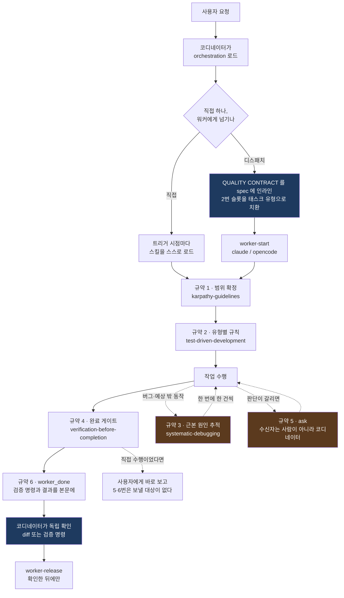
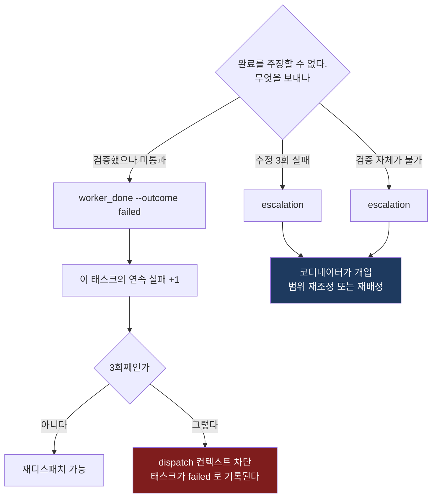

# Orca 사내 배포판 스킬 번들

회사에 설치된 Orca에 그대로 넣어 쓰는 스킬 모음이다. `orchestration`으로 작업을 지시하면
엔지니어링 규율 스킬들이 별도 지시 없이 적절한 시점에 걸리도록 `orchestration`을
커스터마이징해 두었다.

**Orca 소스는 수정하지 않는다.** 이 저장소의 `skills/` 아래 폴더들을 복사만 하면 동작한다.

설치 후 실제로 어떤 동작이 일어나는지는 **[동작 설명서](docs/how-it-works.md)** 에
흐름도와 함께 정리해 두었다. 워커가 밟는 게이트 순서, 스킬이 워커에 닿는 두 경로,
교착이 생기는 지점, 실패 모드별 확인 방법을 다룬다.

번들에 더할 스킬을 검토한 결과는 **[추가 도입 후보](docs/skill-candidates.md)** 에 있다.
Orca orchestration과 충돌하는 스킬이 있어 판정 근거를 함께 적어 두었다.

## 구성

```
skills/
  orchestration/                  stablyai/orca 원문 + 품질 스킬 라우팅 (커스터마이징)
  orca-cli/                       stablyai/orca 원문
  karpathy-guidelines/            범위 통제, 가정 명시, 검증 가능한 성공 기준
  test-driven-development/        구현 전 실패 테스트
  systematic-debugging/           수정 제안 전 근본 원인 추적
  verification-before-completion/ 완료 주장 전 증거
```

## 어디에 넣나

`skills/` **아래의 6개 폴더**를 아래 경로에 통째로 복사한다. `skills/` 폴더 자체가 아니라
그 안의 내용물이다.

| 경로 (Windows) | 경로 (macOS/Linux/WSL) | 넣는 이유 |
|---|---|---|
| `%USERPROFILE%\.agents\skills\` | `~/.agents/skills/` | Orca가 "Agent skills home"으로 인식하는 공용 경로. **필수** |
| `%USERPROFILE%\.claude\skills\` | `~/.claude/skills/` | Claude 워커가 읽는 경로 |
| `%USERPROFILE%\.config\opencode\skills\` | `~/.config/opencode/skills/` | opencode 워커가 읽는 경로 |

**세 곳 모두 넣는 것을 권한다.** `.agents\skills`는 Orca가 스킬을 인식하는 경로이고,
나머지 둘은 워커 에이전트가 실제로 스킬을 로드하는 경로다. 쓰지 않는 에이전트의 경로는
건너뛰어도 된다.

복사 후 이런 모양이 되어야 한다:

```
%USERPROFILE%\.agents\skills\
  orchestration\SKILL.md
  orca-cli\SKILL.md
  karpathy-guidelines\SKILL.md
  systematic-debugging\SKILL.md
  test-driven-development\SKILL.md
  verification-before-completion\SKILL.md
```

같은 이름의 스킬이 이미 있으면 **폴더째 지우고 새로 복사한다.** 파일만 덮어쓰면 상류에서
제거된 참조 문서가 남아 스킬이 없는 파일을 가리키게 된다.

### PowerShell로 한 번에

```powershell
# 저장소를 받은 폴더에서 실행
$src = ".\skills"
foreach ($dst in @(
    "$env:USERPROFILE\.agents\skills",
    "$env:USERPROFILE\.claude\skills",
    "$env:USERPROFILE\.config\opencode\skills"
)) {
    New-Item -ItemType Directory -Path $dst -Force | Out-Null
    Get-ChildItem $src -Directory | ForEach-Object {
        $target = Join-Path $dst $_.Name
        if (Test-Path $target) { Remove-Item $target -Recurse -Force }
        Copy-Item $_.FullName $target -Recurse -Force
    }
    Write-Host "설치: $dst"
}
```

## 설치 확인

복사했다고 동작하는 것이 아니다. 아래 순서로 확인한다.

```bash
# 1. Orca가 스킬을 인식하는가
orca skills installed | grep -E 'karpathy|test-driven|systematic-debug|verification-before'

# 2. orchestration에 라우팅이 실렸는가 (1 이상이어야 한다)
grep -c 'QUALITY CONTRACT' ~/.agents/skills/orchestration/SKILL.md
```

PowerShell이면 2번은 이렇게:

```powershell
Select-String -Path "$env:USERPROFILE\.agents\skills\orchestration\SKILL.md" -Pattern 'QUALITY CONTRACT'
```

**3. 코디네이터가 만든 spec에 플레이스홀더가 남지 않았는지 본다.** 규약 2번은 태스크
유형에 따라 채워야 하는 자리다. `<<`가 남은 채로 디스패치되면 워커는 그 줄을 규칙이 아닌
빈칸으로 읽는다.

```bash
orca orchestration task-list --json | grep -c '<<'   # 0이어야 한다
```

**4. 실제 디스패치 1건으로 확인한다.** 워커의 `worker_done` 보고서(`--body`)에 실행한 검증
명령과 그 결과가 들어 있는지 본다. 없으면 규약이 spec에 실리지 않은 것이다.
1~3번이 통과해도 코디네이터가 spec에 블록을 붙이지 않으면 아무 효과가 없으므로,
이것이 진짜 검증이다.

## 동작 방식

품질 스킬은 **두 경로로** 워커에 도달한다. 하나가 실패해도 나머지가 동작한다.

**1. spec 인라인 (정본).** 코디네이터가 `task-create --spec`에 QUALITY CONTRACT 블록을
이어붙인다. 워커 종류와 무관하게 프롬프트로 들어가므로 opencode 워커에도 적용된다.

**2. 스킬 자동 로드 (보강).** Claude 워커는 스킬 description을 보고 필요한 시점에 스스로
로드한다. 각 스킬에는 `Orca dispatch 컨텍스트` 절이 있어 이 경로로 로드되어도 워커
환경에 맞게 동작한다.

경로 1만으로도 최소 게이트가 서고, 경로 2가 붙으면 세부 규칙까지 적용된다.
**스킬 이름만 적고 규약 본문을 빼면 안 되는 이유가 이것이다** — opencode에는 경로 2가 없다.

### 라우팅

| 스킬 | 걸리는 시점 | 규약 번호 |
|---|---|---|
| `karpathy-guidelines` | 모든 코딩 작업, 범위를 정하는 순간부터 | 1 |
| `test-driven-development` | 구현 코드를 쓰거나 고치기 전 | 2 |
| `systematic-debugging` | 버그·테스트 실패·예상 밖 동작이 나타났을 때 | 3 |
| `verification-before-completion` | 완료 주장, `worker_done`, 커밋, PR 직전 | 4, 6 |

코디네이터 자신이 코드를 짤 때도 동일하게 적용된다. orchestration이 로드되어 있다는 것이
면제 사유가 아니다.

### 한 태스크에서 스킬이 걸리는 순서

아래는 이 브랜치가 배포하는 6종 기준이다. 규약 번호는 워커가 밟는 **시간 순서**이고,
3번과 5번은 단계가 아니라 조건이 맞을 때 발동하는 규칙이라 점선으로 그렸다.
오른쪽 아래 갈래는 디스패치일 때만 성립한다 — 코디네이터가 직접 하는 작업에는
`worker_done`도 `worker-release`도 없다.



### 스킬별 실행

#### `karpathy-guidelines` — 범위를 먼저 고정한다

본문은 네 절이다: 코딩 전에 생각하기, 단순한 것 먼저, 외과적 변경, 목표 기반 실행.
실행되면 스펙의 완료 조건을 **검증 가능한 체크리스트**로 바꾸고, 그 범위 밖의 파일은
건드리지 않는다. 판단이 필요한 지점은 가정을 명시하고 진행하되 보고서에 남긴다.

디스패치 상황에서 두 가지가 달라진다. 본문의 "확실하지 않으면 물어라"의 수신자가
사람이 아니라 코디네이터이고(`orca orchestration ask`), **공유 파일은 가정으로 처리하지
않는다.** 빌드 설정·의존성 매니페스트·공통 설정처럼 다른 태스크도 건드릴 파일은
가정하고 진행하는 대신 물어야 한다. 병렬 워커가 각자 "가정 명시 후 진행"으로 판단하면
같은 파일을 동시에 고쳐 서로의 작업을 덮는다. 이 규칙이 그것을 막는다.

#### `test-driven-development` — 실패를 먼저 본다

Iron Law는 하나다. **실패하는 테스트를 실제로 본 뒤에야 구현 코드를 쓴다.** 테스트가
실패하는 것을 보지 않았다면 그 테스트가 옳은 것을 검사하는지 알 수 없기 때문이다.
Red → Green → Refactor를 돌되 각 전환마다 실행해서 눈으로 확인한다.

규약 2번은 태스크 유형에 따라 갈리는 자리이고, 이 스킬이 적용되는 방식도 함께 갈린다.

| 태스크 유형 | 이 스킬이 요구하는 것 |
|---|---|
| 기능 구현 | 실패 테스트 먼저. 구현을 먼저 썼다면 지우고 다시 시작 |
| 버그 수정 | 위와 같고, **원 증상을 재현하는 테스트**를 남겨 수정 전 실패·수정 후 통과를 확인 |
| 리팩터링 | 새 테스트를 만들지 않는다. 기존 테스트로 기준선을 잡고 전후로 같은 결과 |
| 리뷰·조사 | 파일을 고치지 않는다. 근거를 `경로:줄`로 남긴다 |

리팩터링 행이 예외처럼 보이지만 Iron Law가 뒤집힌 것은 아니다. 겉보기 동작을 바꾸지
않는 작업이라 새로 실패시킬 테스트가 없을 뿐이고, 억지로 만들면 그것은 리팩터링이
아니라 동작 변경이다.

디스패치에서는 본문이 사람의 예외 승인을 요구하는 지점이 `ask`로 바뀐다. **답을 받지
못해도 Iron Law는 유지된다** — 승인 없이는 예외가 성립하지 않으므로, 진행이 불가능하면
`escalation`으로 보고한다. Red와 Green 출력은 `worker_done --body`에 그대로 실어
다음 스킬의 증거가 된다.

#### `systematic-debugging` — 세 번째 실패에서 멈춘다

Iron Law는 **근본 원인을 찾기 전에 고치지 않는다**이다. 근본 원인 조사 → 패턴 분석 →
가설과 검증 → 구현의 네 단계를 밟고, 수정은 한 번에 한 건씩 한다. 여러 변경을 묶어
시도하면 무엇이 효과가 있었는지 알 수 없기 때문이다.

같은 문제에 수정 3회가 실패하면 네 번째를 시도하지 않고 `escalation`을 보낸다. 이 규칙은
Orca 런타임의 dispatch 회로 차단기와 직접 맞물린다 — 규약 6번의 환경 예외도 같은 곳으로
모인다.



**`failed`와 `escalation`을 가르는 기준은 "재시도하면 달라지는가"다.** 검증이 돌았는데
통과하지 못한 것은 재시도의 여지가 있으니 `failed`다. 4번째 수정을 계속 시도하거나
환경 문제를 `failed`로 보고하면 재시도해도 같은 결과가 나오고, 그 실패가 셋 쌓이는
순간 태스크 자체가 죽는다. 규약 3번과 6번이 그 구분을 명시하는 이유가 이것이다.

이 스킬은 `find-polluter.sh`를 실행 파일로 들고 있다. 번들에서 텍스트가 아닌 것은
이것뿐이고 bash가 필요하므로, Windows 워커에서는 [Windows 주의사항](#windows-주의사항)을
함께 본다.

#### `verification-before-completion` — 증거가 없으면 완료가 아니다

Iron Law는 **주장보다 증거가 먼저**다. Gate Function 5단계를 통과하지 못한 채
`--outcome succeeded`를 보내는 것이 이 스킬 위반이다. 위치는 `worker_done` 전송 직전,
즉 워커가 밟는 마지막 게이트다.

이 스킬이 실제로 잡아내는 것은 셋이다.

- **검증 명령이 없는 태스크도 면제가 아니다.** 리뷰나 조사에는 돌릴 테스트가 없지만
  주장은 여전히 한다. 재현하거나 코드에서 짚어 확인한 것만 적고, 확인하지 못한 것은
  추측이라고 표시한다. 읽고 그럴 것 같다고 판단한 것은 증거가 아니다.
- **실패를 산문에만 담지 않는다.** 본문에 실패를 적고 `--outcome succeeded`를 보내면
  Orca는 그 태스크를 성공으로 기록한다. 부분 성공도 실패다.
- **코디네이터도 대상이다.** 워커의 `succeeded`는 증거가 아니라 주장이다. diff나 검증
  명령으로 독립 확인한 뒤에 완료를 보고하고, 그 확인은 `worker-release` **전에** 한다.
  release 후에는 그 터미널의 스크롤백이 사라져 되짚을 수 없다.

### orchestration 자신과 orca-cli 의 자리

`orchestration`은 위 넷을 실행하는 쪽이지 실행되는 쪽이 아니다. 코디네이터가 로드하면
`Bundled quality skills` 절이 라우팅의 정본이 되고, 코디네이터는 그 절이 지시하는 대로
규약을 spec에 인라인한 뒤 2번 슬롯을 치환한다. `orca skills get orchestration`이
서비스하는 가이드에는 이 라우팅이 없으므로, 이 파일 밖에서 찾을 것이 아니다.

`orca-cli`는 이 체인에 **들어가지 않는다.** `worktree create --prompt`와 `terminal send`는
라이프사이클 프리앰블을 전달하지 않아 워커에게 `ask`나 `worker_done`을 보낼 대상이
없다. 그래서 전면 위임에는 규약을 붙이지 않는다. 규약 블록 자체에도 같은 안전장치가
있어서, `taskId`와 `dispatchId` 없이 이 블록을 받은 워커는 5·6번을 빼고 1~4번만 따른 뒤
지시한 사람에게 직접 보고한다.

교착이 생기는 지점, 실패 모드별 확인 방법, 이 구조가 실제로 잡아낸 사례는
[동작 설명서](docs/how-it-works.md)에 있다. 여기가 스킬별 시선이라면 그쪽은 절차와
고장 사례별 시선이다.

## 갱신 시 주의

`orchestration`과 `orca-cli`는 업스트림과 이름·경로가 같다.
`orca skills update --skill orchestration`을 실행하면 커스터마이징이 업스트림 원문으로
덮인다. 갱신은 이 저장소에서 내려받아 다시 복사하는 방식으로만 한다.

## Windows 주의사항

- `systematic-debugging/find-polluter.sh`는 bash가 필요하다(Git Bash 또는 WSL). 없으면
  이 스크립트를 쓰지 말고 수동 이분 탐색으로 대체한다. 스킬 본문에도 같은 내용이 있다.
- 저장소 루트에서 절대 경로로 호출한다. npm 저장소가 아니면 `TEST_CMD`를 지정한다:
  `TEST_CMD='pnpm vitest run' bash <skills-dir>/systematic-debugging/find-polluter.sh '.git' 'src/**/*.test.ts'`
- 나머지 스킬은 순수 텍스트 지침이라 OS 의존성이 없다.

## 상류 원본

본문은 원문 그대로이고, 각 스킬에 `Orca dispatch 컨텍스트` 절과 출처절만 추가했다.
수정한 곳은 각 스킬의 출처절에 건별로 적혀 있다.

| 스킬 | 상류 | 커밋 | 라이선스 |
|---|---|---|---|
| `orchestration` | `stablyai/orca` | `c5d43b8a` | 상류 저장소 라이선스 |
| `orca-cli` | `stablyai/orca` | `c5d43b8a` | 상류 저장소 라이선스 |
| `karpathy-guidelines` | `multica-ai/andrej-karpathy-skills` | `2c606141936f` | MIT |
| `test-driven-development` | `obra/superpowers` | `b36e0829c6d0` | MIT (Jesse Vincent) |
| `systematic-debugging` | `obra/superpowers` | `b36e0829c6d0` | MIT (Jesse Vincent) |
| `verification-before-completion` | `obra/superpowers` | `b36e0829c6d0` | MIT (Jesse Vincent) |

상류를 갱신할 때는 위 커밋에서 diff를 떠서 원문 변경분만 반영하고, 추가한 두 절은
유지한다. `superpowers:` 네임스페이스 접두어는 이 배포판이 그 네임스페이스로 설치되지
않으므로 다시 들어오지 않게 확인한다.
