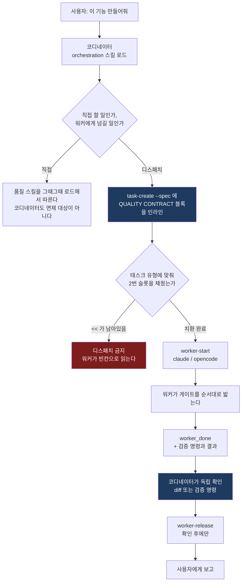
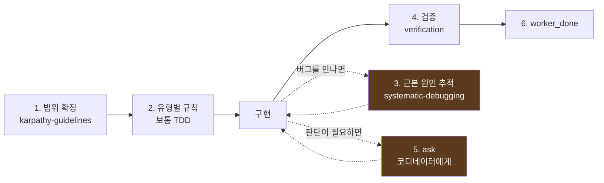
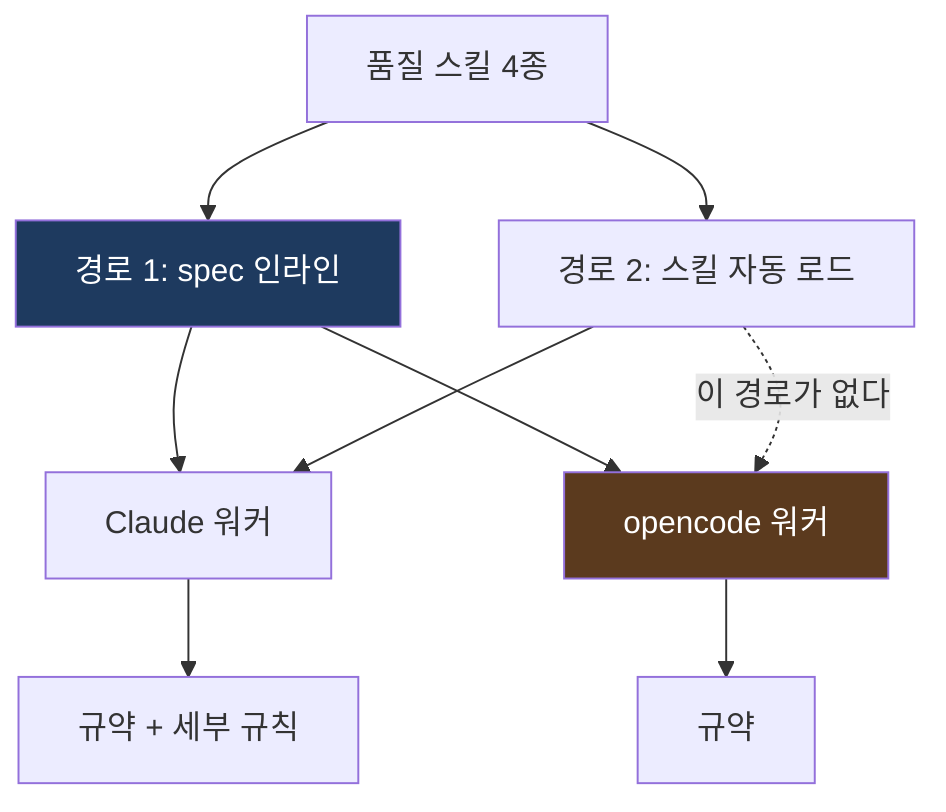

# orchestration을 쓰면 무슨 일이 일어나나

이 번들을 설치한 뒤 Orca에서 `orchestration`으로 작업을 지시했을 때의 동작을 정리한다.

## 한 눈에 보기

## 워커가 밟는 게이트

규약의 번호는 **시간 순서**다. 위에서 아래로 읽으면 그대로 작업 순서가 된다.

1번과 2번, 4번, 6번은 순서대로 지나가는 단계다. 3번과 5번은 단계가 아니라 **작업 도중
조건이 맞으면 발동하는 규칙**이라 점선으로 그렸다.

| 번호 | 규칙 | 언제 |
|---|---|---|
| 1 | 완료 조건을 체크리스트로, 범위 밖 파일 금지. 공유 파일은 ask | 착수 전 |
| 1-1 | 산출물이 아닌 파일은 `.orca/artifacts/<task_id>/` 아래에만 (디스패치 밖에서도 같다) | 작업 파일을 쓸 때마다 |
| 2 | 태스크 유형별 규칙 (코드 작업이면 실패 테스트 먼저) | 일을 시작할 때 |
| 3 | 수정 제안 전 근본 원인 추적, 한 번에 하나씩, 3회 실패 시 escalation | 버그를 만났을 때 |
| 4 | 근거를 직접 확인한다. 명령이 있으면 실행하고, 없으면(리뷰·조사) 주장을 재현한다 | 완료 주장 직전 |
| 5 | 질문은 사람이 아니라 `orca orchestration ask` | 판단이 갈릴 때 |
| 6 | 보고서에 검증 명령과 결과, 미통과면 `--outcome failed`. 환경 탓에 검증 자체가 불가능하면 `escalation` | 마지막 |

2번이 유형에 따라 갈리는 자리다.

| 태스크 유형 | 2번에 들어가는 것 |
|---|---|
| 기능 구현 | 실패 테스트 먼저. 구현을 먼저 썼다면 지우고 다시 |
| 버그 수정 | 실패 테스트 먼저 + 원 증상 재현 테스트 |
| 리팩터링 | 기존 테스트로 기준선을 잡고, 전후로 같은 테스트가 통과. 새 테스트는 만들지 않는다 |
| 리뷰 전용 | 파일을 고치지 않는다 + 발견 사항을 재현으로 확인한다 |
| 조사 | 근거를 경로:줄로 남기고, 읽은 것과 실행해 확인한 것을 구분한다 |

## 스킬이 워커에 닿는 두 경로

**경로 1이 정본이다.** 규약 본문이 프롬프트에 직접 들어가므로 워커 종류를 가리지 않는다.

**경로 2는 보강이다.** Claude 워커는 스킬 description을 보고 필요한 시점에 스스로
로드하고, 각 스킬의 `Orca dispatch 컨텍스트` 절까지 읽어 세부 규칙을 따른다.
opencode에는 이 메커니즘이 없다.

그래서 **spec에 스킬 이름만 적고 규약 본문을 빼면 안 된다.** 그렇게 하면 Claude 워커에서만
동작하고 opencode 워커에서는 조용히 누락된다.

## 교착을 막는 지점

번들된 스킬들은 원래 사람이 옆에 있는 대화형 세션을 전제로 쓰였다. 본문에
"ask your human partner", "Discuss with your human partner" 같은 정지점이 있다.
디스패치된 워커 터미널에는 사람이 없다.

```mermaid
sequenceDiagram
    participant C as 코디네이터
    participant W as 워커

    C->>W: dispatch (spec + 프리앰블)
    Note over W: 판단이 필요한 지점에 도달

    rect rgb(90, 30, 30)
    Note over W: 규약 5가 없으면
    W-->>W: 터미널에 질문 출력 후 대기
    C-->>C: check --wait 타임아웃<br/>= 실패 아님, 계속 대기
    Note over C,W: 양쪽이 서로를 기다린다
    end

    rect rgb(30, 60, 40)
    Note over W: 규약 5가 있으면
    W->>C: orchestration ask
    C->>W: reply
    W->>C: worker_done
    end
```

Orca 가이드는 코디네이터에게 *"`check --wait` 타임아웃을 워커 실패로 보지 말고 계속
기다리라"* 고 지시한다. 옳은 규칙이지만, 워커가 사람을 기다리고 있으면 이 규칙 때문에
교착이 풀리지 않는다. 규약 5는 어떤 태스크에서도 빼지 않는다.

## 이 구조가 실제로 잡아내는 것

`Workspace/widget`(Swift, AI 사용량 메뉴바 앱)에 가상 기능을 붙여 검증한 결과다.
소진 속도로 리셋 시점 사용률을 예측하는 기능이었고, `elapsed=0`에서 `inf`가 나왔다.

| 수정안 | 1초 경과 / 3% 사용일 때 예측 | 기존 테스트 |
|---|---|---|
| `isFinite`로 `inf`만 막기 | 54,003% → **한도초과 경고** | **7/7 통과** |
| `elapsed > 0` 가드 | 54,003% → **한도초과 경고** | 통과 |
| 최소 표본 시간 가드 | 3% → 정상 | 통과 |

표면 수정으로도 **테스트가 전부 통과한다.** 규약 3(근본 원인 추적)이 없었다면 워커는
여기서 `succeeded`를 보고했을 것이고, 사용자는 세션 시작 5분 안에 항상 한도초과 경고를
보게 된다.

근본 원인을 추적한 뒤에야 "짧은 구간의 속도를 외삽하면 폭발한다"는 진짜 문제가 보였고,
그 이해가 있어야 나오는 테스트(1초·60초 경과 케이스)를 추가하니 표면 수정이 3건 실패로
걸러졌다.

## 실패 모드

동작하지 않을 때 여기부터 본다.

| 증상 | 원인 | 확인 |
|---|---|---|
| 워커가 규약을 무시한다 | 코디네이터가 spec에 블록을 안 붙였다 | `worker_done --body`에 검증 명령이 있는지 |
| 2번 규칙이 빈칸이다 | `<<...>>` 플레이스홀더를 안 채웠다 | spec에 `<<`가 남았는지 |
| opencode 워커만 규약을 안 지킨다 | 스킬 이름만 적고 본문을 뺐다 | spec에 QUALITY CONTRACT 본문이 있는지 |
| 워커가 응답 없이 멈춰 있다 | 규약 5를 뺐고 워커가 사람을 기다린다 | 워커 터미널에 질문이 떠 있는지 |
| 커스터마이징이 사라졌다 | `orca skills update`가 업스트림으로 덮었다 | `grep -c 'QUALITY CONTRACT'` |
| 리뷰 보고서가 추측투성이다 | 규약 4를 명령 실행으로만 읽었다 | 발견 사항에 재현 근거가 있는지 |
| 같은 태스크가 3번 실패하고 죽었다 | 환경 문제를 `failed`로 보고했다 | 실패 사유가 도구·권한·네트워크인지 |
| 병렬 워커가 서로의 변경을 덮었다 | 공유 파일을 각자 "가정 명시 후 진행"으로 고쳤다 | 두 `files-modified`에 같은 파일이 있는지 |
| 거짓 보고를 뒤늦게 알았다 | `worker-release` 후에 확인했다 | release 전에 diff를 봤는지 |
| 리팩터링인데 새 테스트를 만들었다 | 리팩터링 행 대신 기능 구현 행을 넣었다 | spec 2번 줄이 "새 테스트를 만들지 않는다"인지 |
| 계획·노트 파일이 저장소 곳곳에 남았다 | 규약 1-1을 spec에 안 붙였다 — 워커는 스킬 파일이 아니라 spec만 본다 | `git status`에 `.orca/` 밖 작업 파일이 있는지 |

설치와 검증 절차는 [README](../README.md)에 있다.
